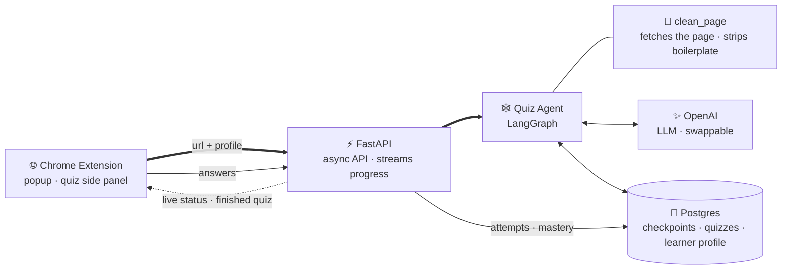
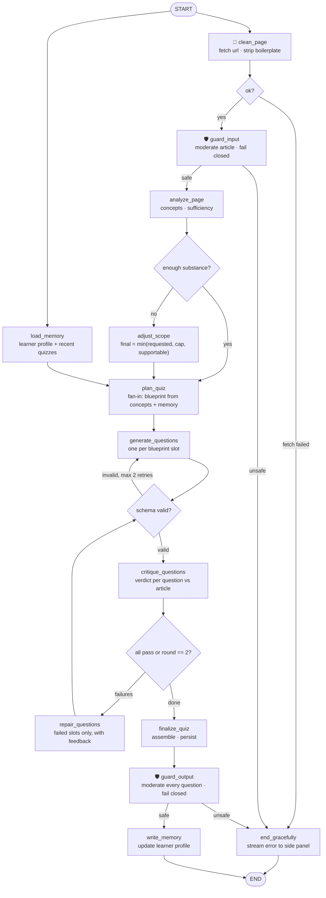

# Hyris

Turn any web page into a personalized quiz. V1 is a LangGraph agent that plans, generates, critiques and adapts, grounded strictly in the current page, with three layers of memory.

▶️ **[Try the live prototype](https://bukunmialuko.github.io/hyris/)** (no install required)

| Aspect | V1 |
|---|---|
| Source of truth | The current page only |
| Orchestration | LangGraph with a Postgres checkpointer |
| Memory | Graph checkpoints, quiz and attempt history, learner profile |
| Tools | `clean_page` in V1, fact-check button later |

## Orchestration patterns

Code owns the control flow; the LLM fills in content. Of the classic
[agent workflow patterns](https://www.anthropic.com/engineering/building-effective-agents),
V1 composes three — deliberately stopping short of an autonomous agent:

| Pattern | Where it lives in Hyris |
|---|---|
| Prompt chaining | The backbone: `analyze_page` → `plan_quiz` → `generate_questions`, each step consuming the last one's structured output |
| Parallelization | The START fan-out: `load_memory` runs while the page is fetched and cleaned; branches meet at `plan_quiz` |
| Evaluator-optimizer | The signature loop: `generate_questions` optimizes, `critique_questions` evaluates, repair feeds verdicts back (max 2 rounds) |
| ReAct agent | Not in V1 — reserved for the V2 fact-check button, embedded as a single node |

## Local development

One conda env covers all the Python here — the API, its tooling, and the `research/` notebooks.

```bash
conda create -n agents python=3.11 -y
conda activate agents
pip install -e "apps/api[dev]" -r research/requirements.txt
```

Then, with the env active:

```bash
# Extension — then load apps/extension/dist as an unpacked extension
npm install
npm run dev:ext

# API — copy .env.example to .env and set OPENAI_API_KEY first
uvicorn app.main:app --reload --app-dir apps/api

# Or run everything in Docker (API + Postgres), no conda env needed
docker compose up --build

# Tests (no API key needed — the suite runs on a fake LLM) and lint
pytest apps/api
npm run test:ext
ruff check apps/api
```

Two environment variables shape behaviour:

- `AUTH_SECRET` — without it every caller is `anonymous` and `POST /auth/device` returns 503.
- `DATABASE_URL` — without it memory is in-process. With it, run `docker compose up -d db` and
  `(cd apps/api && alembic upgrade head)`; export the variable, since alembic reads the repo-root `.env`.

Retention is not automatic: `cd apps/api && python -m app.prune` deletes aged-out checkpoints and quizzes.

VSCode is pre-wired by the committed [.vscode/settings.json](.vscode/settings.json) — install the
recommended extensions (Python, Pylance, Ruff) and pick the `agents` interpreter if imports look unresolved.

## Using the API

Generation is asynchronous: `POST /quiz/generate` returns 202 with a `run_id`, then you poll or stream.

| Endpoint | What it does |
|---|---|
| `POST /auth/device` | Registers a device, returns `{user_id, token}` for `Authorization: Bearer` |
| `POST /quiz/generate` | Starts a run from a `page_url` + profile; returns a `run_id` |
| `GET /quiz/runs/{id}` | Poll: `status`, `steps` so far, final `quiz` or user-safe `error` |
| `GET /quiz/runs/{id}/events` | Same progress as a live SSE stream |
| `GET /quizzes` | This caller's past quizzes, newest first |
| `POST /attempts` | Submits answers, scored server-side against the stored quiz |

```bash
curl -X POST http://localhost:8000/quiz/generate \
  -H "Content-Type: application/json" -H "Authorization: Bearer $TOKEN" \
  -d '{"page_url": "https://en.wikipedia.org/wiki/Photosynthesis",
       "profile": {"question_count": 4, "difficulty": "medium"}}'
```

Send no header and you are `anonymous` — one shared profile, which is why curl keeps working
without registering. The legacy `X-User-Id` header is forgeable, so every use is logged and
`ALLOW_HEADER_IDENTITY=false` refuses it outright.

## System design



Generation is asynchronous because an LLM pipeline can take 30 to 90 seconds, longer than a plain
HTTP request reliably survives. The extension polls rather than consuming the SSE stream because
`EventSource` does not exist in an MV3 service worker — and keeping the run owned by the worker means
it survives the side panel being closed mid-generation. The LangGraph runtime lives inside the
FastAPI process as a single deployable, but stays a separate module so it can be split out later.

## Agent graph

The workflow fans out in parallel from START: the memory read runs while the page is fetched, and
the branches meet at `plan_quiz`. Tools never raise; failures route to a graceful exit. Safety
guardrails are first-class nodes and all fail closed, so nothing unsafe ever ships.



## Graph state

Every node reads from and writes to one shared typed state. The parallel branches write
different keys, so the fan-in needs no reducers.

| Field | What it holds | Written by |
|---|---|---|
| `page_url` | The only input from the extension, plus profile settings | input |
| `learner_context` | Mastered concepts, weak concepts, recent question hashes | `load_memory` |
| `clean_text`, `title`, `truncated` | Boilerplate-free article, capped at 6k words | `clean_page` |
| `concepts` | Quiz-worthy concepts with salience and verbatim supporting spans | `analyze_page` |
| `sufficiency`, `max_supportable` | Can the page support the request, and how far | `analyze_page` |
| `final_count`, `note` | `min(requested, cap 20, supportable)` and the user-facing note | `adjust_scope` |
| `blueprint` | Slots: concept, Bloom level, variant flag | `plan_quiz` |
| `questions`, `pending_slots`, `feedback` | Generated questions and the repair queue | `generate_questions`, gate, critic |
| `round`, `gen_retries` | Loop bounds: max 2 repair rounds, max 2 schema retries | gate, critic |
| `quiz` | The final contract-shaped quiz | `finalize_quiz` |
| `error` | User-safe message when a run ends gracefully | any guard or tool |

## Memory model

Three layers, one Postgres instance, all live when `DATABASE_URL` is set; with it unset each falls
back to an in-memory equivalent and the API still serves.

| Layer | Kind | Backed by | What it does |
|---|---|---|---|
| Graph checkpoints | Thread | LangGraph `AsyncPostgresSaver` | Every node transition, per run: resumable, debuggable, and the reason a poll can be answered by a worker that did not run the graph |
| Quiz and attempt history | Episodic | `quizzes`, `quiz_attempts` | Powers `GET /quizzes` and lets `POST /attempts` score against the stored quiz rather than trusting the client |
| Learner profile | Semantic | LangGraph `PostgresStore` | Per-concept mastery (EMA over attempts) and per-domain question hashes, driving adaptive difficulty |

The loop closes on every attempt: correct answers raise a concept's mastery, wrong answers
lower it, and the next quiz on that topic plans around what changed.

## Guardrails

All safety checks **fail closed**: if a check cannot run, the run ends gracefully — no quiz
ever ships unchecked.

| Stage | Guard | What it blocks |
|---|---|---|
| Before fetch | SSRF guard | Private, loopback, link-local and cloud-metadata addresses |
| Pre-agent | `guard_input` moderation | Pages with self-harm, sexual content involving minors, extremism, weapons instructions — refused before any LLM sees them |
| In every prompt | Injection hardening | Article text is delimited as untrusted data, never instructions |
| During generation | Schema gate + critic | Malformed questions, wrong answer keys, ungrounded or ambiguous questions |
| Post-agent | `guard_output` moderation | Any unsafe generated question, dropped before delivery |

Deferred to the API port: rate limiting, per-user cost caps, auth.

## Quiz planning

The number of questions delivered is `min(requested, hard cap of 20, what the page supports)`.
The planner ranks concepts by the learner's history: weak concepts come first, new material
next, mastered concepts last and one Bloom level harder. When the page has fewer concepts
than requested questions, the planner reuses rich concepts at other Bloom levels before
shrinking the quiz — and it never pads with trivia.

Example: 6 questions requested from 3 concepts, difficulty hard, with one weak and one
mastered concept in memory:

| Slot | Concept              | Bloom level | Why                          |
|------|----------------------|-------------|------------------------------|
| 0    | multi-head attention | analyse     | weak concept, retest first   |
| 1    | positional encoding  | analyse     | new material                 |
| 2    | self-attention       | evaluate    | mastered, bumped harder      |
| 3    | multi-head attention | evaluate    | variant, next Bloom level    |
| 4    | positional encoding  | evaluate    | variant                      |
| 5    | self-attention       | apply       | variant                      |

Every slot is a unique concept and Bloom level pair, so questions stay distinct.

## V1 scope

Chrome Extension + FastAPI + LangGraph agent + LLM + PostgreSQL. The current page is the only
source of truth. One tool (`clean_page`) and three memory layers, all persisted. No web search, no
RAG, no microservices. In one phrase: an evaluator-optimizer workflow with parallel fan-out.

## License

MIT © 2026 Oluwabukunmi Aluko — see [LICENSE](LICENSE).
